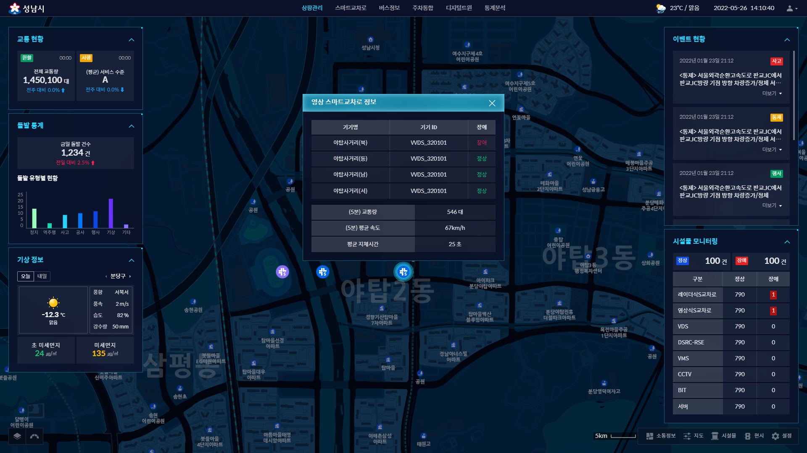

### 성남 ITS 관제화면 리액트 타입스크립트 퍼블리싱



+ 성남 ITS 리액트 환경 타입스크립트 퍼블리싱입니다. (tsx, scss)

```
- git clone http://git.uinetworks.kr/design/SeongNamITS-type-publishing.git
- npm install
- npm start
```

+ pages/template : 참고용 페이지, pages/seongnam : 성남시 화면 페이지

+ 1920 이상의 모든 해상도에 대응하기 위해 단위는 rem 사용했습니다. (14px = 0.875rem, 16px = 1rem)   
성남 ITS는 해상도 2560 x 1440 대응시에 컨텐츠 1.2배로 커지게 스타일링 되어있습니다.
해상도 3840 x 2160 대응시에 컨텐츠 1.7배로 커지게 스타일링 되어있습니다.